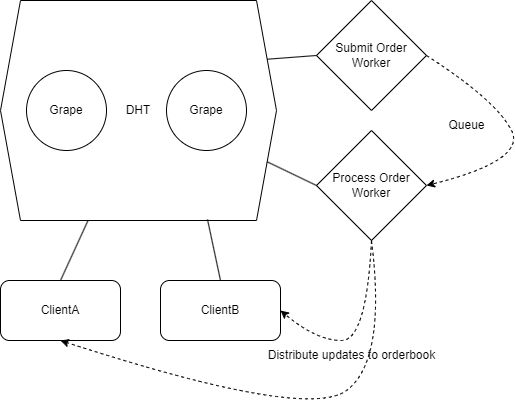

# simple_distributed_exchange

## Challenge
Your task is to create a simplified distributed exchange

* Each client will have its own instance of the orderbook.
* Clients submit orders to their own instance of orderbook. The order is distributed to other instances, too.
* If a client's order matches with another order, any remainer is added to the orderbook, too.

Requirement:
* Code in Javascript
* Use Grenache for communication between nodes
* Simple order matching engine
* You don't need to create a UI or HTTP API

Tips

 - you don't need to store state in a DB or filesystem
 - it is possible to solve the task with the node std lib, async and grenache libraries
 - beware of race conditions!
 - no need for express or any other http api layers

# My Initial Observations

 - Servers announce topics (by `key`) that they act upon; on an interval, for redundancy incase grapes do down
 - Grenache `link.announce` sends request to grape to announce that requests for `key` should notify server on `port`
 - Pub/Sub implementation used to broadcast events to instances in the Grenache network by topic
	- Publishing to topics can be achieved by client sending a request on the topic with a payload to all registered workers using `PeerRPCClient.map`
		- `PeerRPCClient.request` = Sends a single request to a RPC server/worker
			- Checked to see if multiple nodes receive a published event when using `PeerRPCClient.request`, but only a single node receives the event as is only using a single connection between the client and server
		- `PeerRPCClient.map` = Maps a number of requests over the amount of registered workers / PeerRPCServers
	- Subscribing to topics can be achieved by abstracting over a server that announces to the topic by `key`
 - Data can be stored and retrieved in the DHT using `link.put` (returns `hash` value) and `link.get` (by `hash`)

# Focused on

 - Decoupling microservices for separation of concerns
 - Queuing system as a synchronous mechanism to prevent race conditions, data corruption and inconsistencies
 - Consistency of the orderbook across all nodes
 - DRY, reusable and testable code

# Proposed Solution

 - Submit order worker operates on the `submit_order` event by storing the payload in a queue, the queue is stored and processed in FIFO and sent to a process order worker (polling is used to process the queue in this example, whereas consuming AWS SQS in a Lambda or similar with retry and DLQ semantics would be preferred)
 - Process order worker operates on the `process_order` event and applies the business logic for new orders being submitted to the orderbook, when an order is matched or added to the orderbook, then the orderbook is stored in the DHT using `link.put`, and then the update is broadcast to all instances of the orderbook in the Grenache network by publishing to the `orderbook_updated` event using `PeerRPCClient.map` with the `link.put` DHT hash as the payload
 - Clients can submit orders to their own instance of orderbook, and the order is distributed to other instances, too by sending a request to the `submit_order` worker with the order payload
 - Clients can subscribe to the `orderbook_updated` event and get the updated orderbook from DHT using `link.get` with the supplied DHT `hash` value

# Code

Find both `client` and `workers` under `/bin`.

 - `npm install` and start two grapes
 - Run submit order worker with `node bin/submitOrderWorker.js`
 - Run process order worker with `node bin/processOrderWorker.js`
 - Run x number of clients with `node bin/client.js`

Find reusable code under `/lib`.

# With more time

 - Implement order matching logic that checks against existing orders in the orderbook, by checking buy sell price and remainder
 - Error handling at each level to revert whilst maintaining a consistent state
 - Input validation on communication between microservices
 - Unit and integration tests against the proposed solution
 - Code lint, quality checks and optimisations
 - Cleanup to prevent orderbook from growing to big